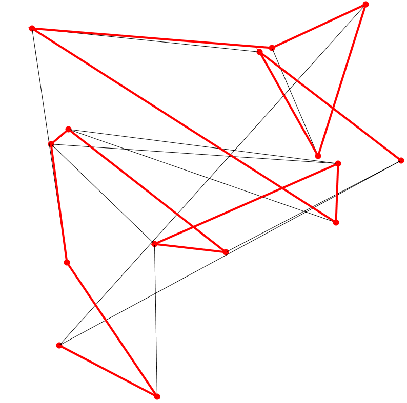

# Travelling_Salesman_Problem

## A Proccessing Visualization of TSP

<!-- @import "[TOC]" {cmd="toc" depthFrom=1 depthTo=6 orderedList=false} -->

<!-- code_chunk_output -->

- [Travelling_Salesman_Problem](#travelling_salesman_problem)
  - [A Proccessing Visualization of TSP](#a-proccessing-visualization-of-tsp)

<!-- /code_chunk_output -->

 

  <h3>Introduction</h3>
  

  The travelling salesman problem (also called the traveling salesperson problem[1] or TSP) asks the following question: "Given a list of cities and the distances between each pair of cities, what is the shortest possible route that visits each city exactly once and returns to the origin city?" It is an NP-hard problem in combinatorial optimization, important in theoretical computer science and operations research.

The travelling purchaser problem and the vehicle routing problem are both generalizations of TSP.

In the theory of computational complexity, the decision version of the TSP (where given a length L, the task is to decide whether the graph has a tour of at most L) belongs to the class of NP-complete problems. Thus, it is possible that the worst-case running time for any algorithm for the TSP increases superpolynomially (but no more than exponentially) with the number of cities.

The problem was first formulated in 1930 and is one of the most intensively studied problems in optimization. It is used as a benchmark for many optimization methods. Even though the problem is computationally difficult, many heuristics and exact algorithms are known, so that some instances with tens of thousands of cities can be solved completely and even problems with millions of cities can be approximated within a small fraction of 1%.

The TSP has several applications even in its purest formulation, such as planning, logistics, and the manufacture of microchips. Slightly modified, it appears as a sub-problem in many areas, such as DNA sequencing. In these applications, the concept city represents, for example, customers, soldering points, or DNA fragments, and the concept distance represents travelling times or cost, or a similarity measure between DNA fragments. The TSP also appears in astronomy, as astronomers observing many sources will want to minimize the time spent moving the telescope between the sources; in such problems, the TSP can be imbedded inside an optimal control problem.In many applications, additional constraints such as limited resources or time windows may be imposed. 
<a href="https://en.wikipedia.org/wiki/Travelling_salesman_problem" target="_blank">Travelling salesman problem:Wiki</a>

  

  

  <h3>What is Processing?</h3>
  

  <i>"Processing by it's own is a kind of programming language"</i> 
   
  Processing is a flexible software sketchbook and a language for learning how to code within the context of the visual arts. Since 2001, Processing has promoted software literacy within the visual arts and visual literacy within technology. There are tens of thousands of students, artists, designers, researchers, and hobbyists who use Processing for learning and prototyping.Processing uses java, so every java developer can understand the codes easily. There is also a javascript version of Processing known as <strong>p5.js</strong>.Also there is python version known as <strong>p5.py</strong>
  

  <a href="https://processing.org/" target="_blank">Processing Foundation</a>

  

  

  

  

  <h3>Code Behind TSP brute force method..</h3>
  

  This code use brute force method to solve the TSP problem(which is very bad I know..).I simply calculated the distance between very point in space, summed them, and stored them in a variable. Compared every path distance,the path which output the least distance is highlighted with red bold line.This will take a great amount of time.So,obivously it's not a good solution still it was fun 😄!. 
  

  

<h4 style="color:red;">Note: You need Processing installed to run this code!.</h4>
